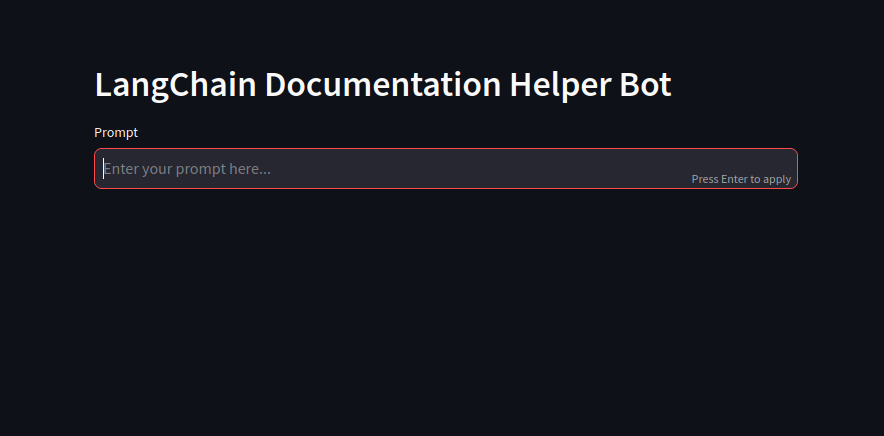
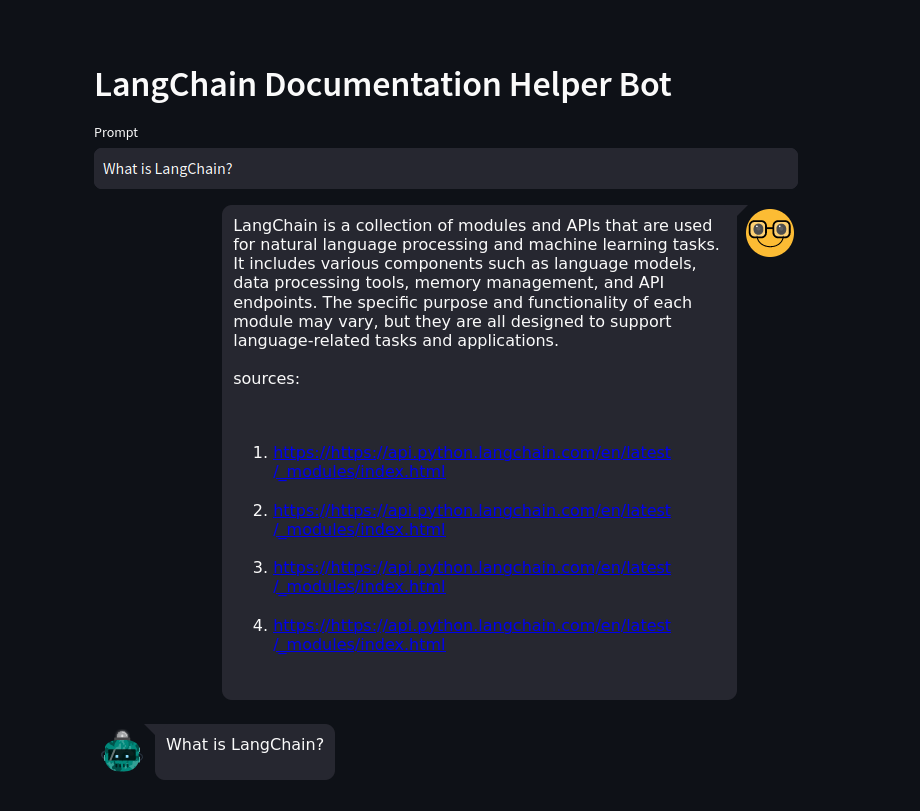

# Documentation-Helper
Documentation Helper is a LLM application build using Langchain Framework that can serach how to use any function from the documentation.

# How to run the project 
To run the project first clone this repository and install requirements.txt file

```bash
  pip install -r requirements.txt
```

Open your terminal and activate the virtual environment and hit the below command
```bash
    streamlit run main.py 
```

# Screenshots

Here are few screenshots of the LangChain Documentation Helper Bot

# Initial chat


# Conversation with bot chat

